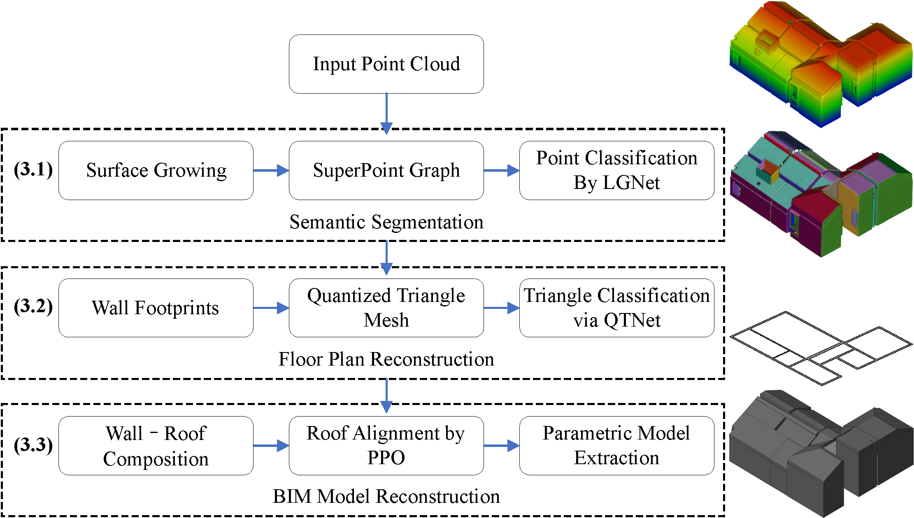
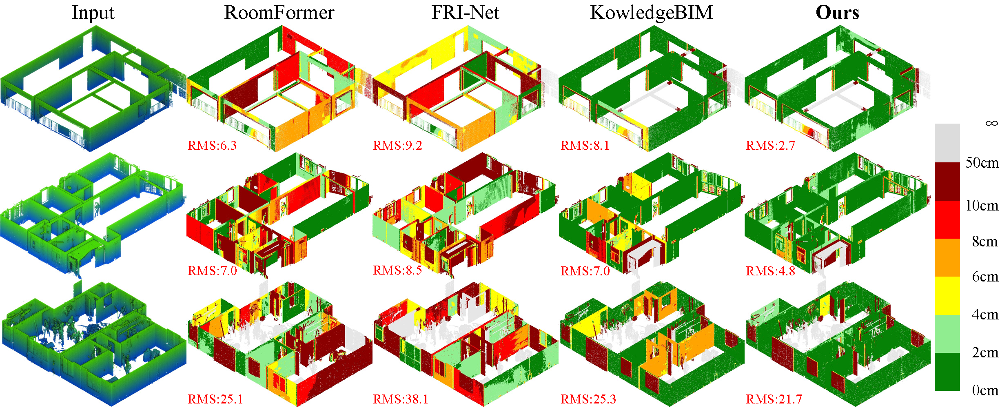
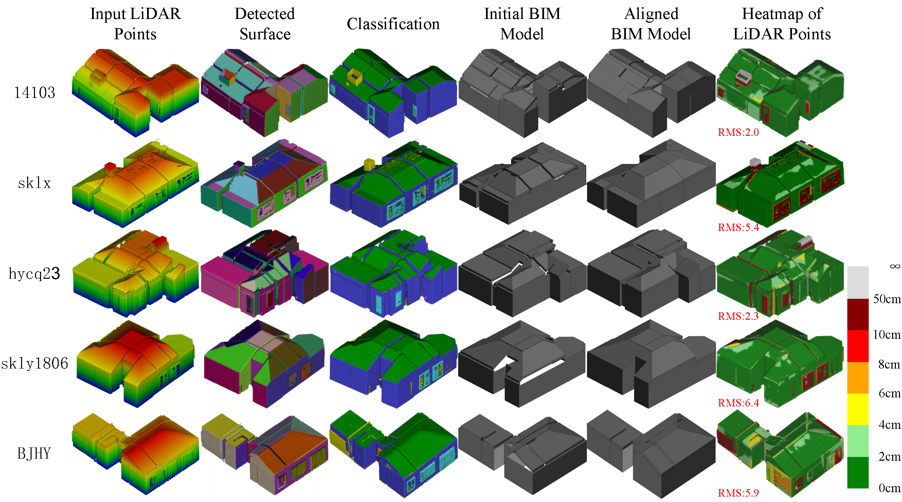

# Roof-Aware Indoor BIM Reconstruction from LiDAR via Graph-Attention

This repository contains the official implementation of the paper:

**Roof-Aware Indoor BIM Reconstruction from LiDAR via Graph-Attention for Residential Buildings**  
*ISPRS Journal of Photogrammetry and Remote Sensing*

The code provides an end-to-end **scan-to-BIM pipeline** for reconstructing **roof-aware, watertight, and Revit-compatible BIM models** from indoor terrestrial LiDAR point clouds.

<b>Figuer 1: Overview of the proposed scan-to-BIM pipeline for Residential Buildings.</b>
  

<b>Figuer 2: RMS error visualization between reconstructed floor plans and original LiDAR
point clouds on WHUTS.</b>
  

<b>Figure 3: Reconstructed BIM models on the WHUTS dataset</b>

